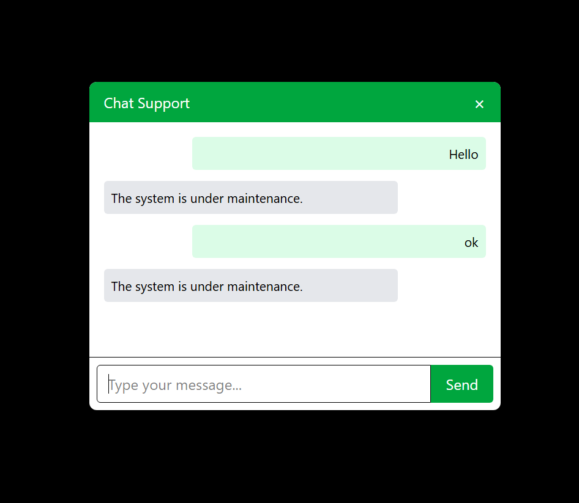

# Hello Friend - Intelligent AI Assistant

📌 Project Description – Hello Friend AI Agent Website
The Hello Friend AI Agent is a web-based platform designed to offer a seamless and interactive user experience by integrating AI-driven features with essential e-commerce functionalities. The current version of the system includes the following key components:

✅ Key Features:
Chat Interface (AI Agent)

Users can initiate a conversation with the AI agent through a chat window.

The system currently responds with a placeholder message: “Under maintenance”, indicating that the conversational engine is being developed for future intelligent interaction.

Product Search Functionality

Users can search for products using keywords.

The search feature is designed to provide relevant product listings based on user queries.

Product Recommendation Section

A dedicated section on the homepage showcases recommended products.

Users can click on items to view detailed product information through the Product Details Page.

User Authentication System

Includes Login and Registration pages to ensure secure access and personalized user experiences.

About Page

Provides background information about the Hello Friend AI Agent project, its purpose, and future scope.

⚙️ Technology Stack (Current Implementation):
Frontend: React.js with Tailwind CSS and DaisyUI

Routing: React Router

State Management: Basic React state (optional enhancements pending)

Authentication & Backend: Under development or mock setup (based on implementation progress)

This version sets the foundation for a more intelligent, AI-assisted user platform. Future updates will include full conversational AI support, advanced recommendations, and user behavior analysis.

---

## 🚀 Features
- 🤖 Conversational AI Assistant
- 🛍️ Product Recommendation System
- 🧲 Magnetic Search Engine
- 🔐 Firebase Authentication
- 🌐 Real-time Chat Interface
- 📊 MongoDB-powered Data Management
- ⚙️ Admin & User Dashboard (optional)

---

## 🛠️ Tech Stack
**Frontend:**
- React
- React Router
- React Typewriter
- React Icons
- Tailwind CSS
- DaisyUI
- Vite

**Backend & Tools:**
- Node.js
- Express.js
- MongoDB
- Firebase Auth
- Next.js (optional routing & SSR/SEO support)
- Other tools: dotenv, axios, etc.

---

## 📁 Project Structure
```
Hello-Friend/
├── client/            # Frontend (React + Vite + Tailwind + DaisyUI)
│   ├── src/
│   │   ├── components/
│   │   ├── pages/
│   │   ├── App.jsx
│   │   └── main.jsx
│   └── index.html
├── server/            # Backend (Node.js + Express + MongoDB)
│   ├── routes/
│   ├── controllers/
│   ├── models/
│   └── server.js
├── .env
├── README.md
└── package.json
```

---

## 🔧 Installation & Setup

### 1. Clone the Repository
```bash
git clone https://github.com/AbdullahAlNoman20/Hello-Friend-Agent
cd hello-friend-Agent
```

### 2. Setup Client (Frontend)
```bash
cd client
npm install
npm run dev
```

### 3. Setup Server (Backend)
```bash
cd server
npm install
node server.js
```

### 4. Firebase Setup
- Create Firebase Project.
- Enable Email/Password Authentication.
- Copy config into `client/src/firebase.config.js`

### 5. MongoDB Setup
- Use MongoDB Atlas or local MongoDB.
- Save URI in `.env` file:
```
MONGODB_URI=mongodb+srv://<username>:<password>@cluster0.mongodb.net/hello-friend
```

### 6. Environment Variables (`.env`)
```
PORT=5000
MONGODB_URI=your-mongodb-uri
FIREBASE_API_KEY=your-firebase-api-key
```

---

## 🧠 How It Works

1. **User Authentication:**
   - Firebase handles registration/login.
2. **Chat Interaction:**
   - The AI agent uses pre-trained intent classification and keyword matching (or LLM APIs).
3. **Product Recommendation:**
   - Based on user queries, preferences, and chat history.
4. **Magnetic Search Engine:**
   - Indexes product metadata and recommends with fuzzy matching.
5. **Admin Controls (Optional):**
   - Product uploads, intent training, etc.

---

## 📸 Screenshots
> **Add your screenshots inside `/screenshots` folder and reference them below:**

### 🖥️ Homepage


### 💬 Chat Interface


### 🔍 Product Search


---

## 📦 Deployment

You can deploy the frontend using **Vercel** or **Netlify** and backend on **Render**, **Railway**, or **Heroku**.

### Example Vercel (Frontend):
1. Connect GitHub repo to Vercel
2. Set build command: `npm run build`
3. Set output directory: `dist`

### Example Render (Backend):
1. New Web Service
2. Select backend folder
3. Build command: `npm install`
4. Start command: `node server.js`

---

## 📚 Future Improvements
- Integrate OpenAI/Gemini/Claude API for better responses
- Add voice chat
- Integrate payment system
- Real-time socket-based chat (using Socket.io)

---

## 📄 License
This project is licensed under the MIT License.

---

## 🙌 Acknowledgments
Thanks to all the open-source packages and tools that made this project possible.

---

## 👤 Author
**Abdullah Al Noman**  
[LinkedIn](https://www.linkedin.com/in/abdullah-al-noman-khu/) | [GitHub](https://github.com/AbdullahAlNoman20)
